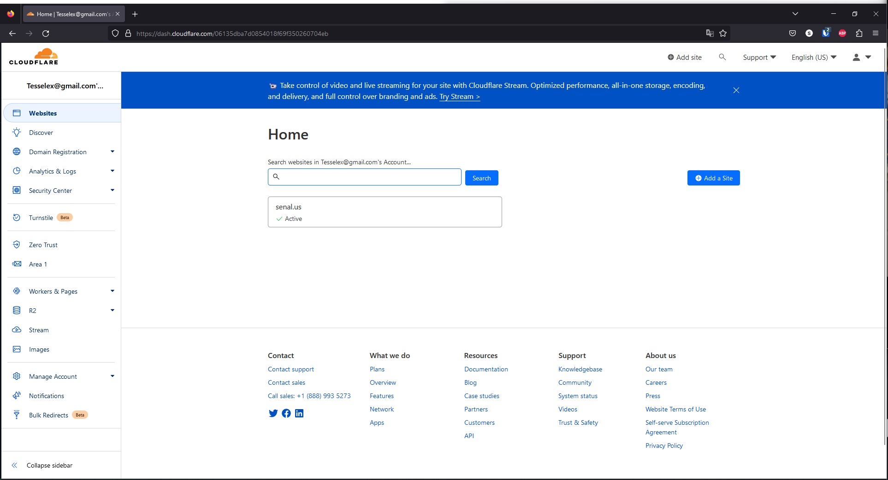
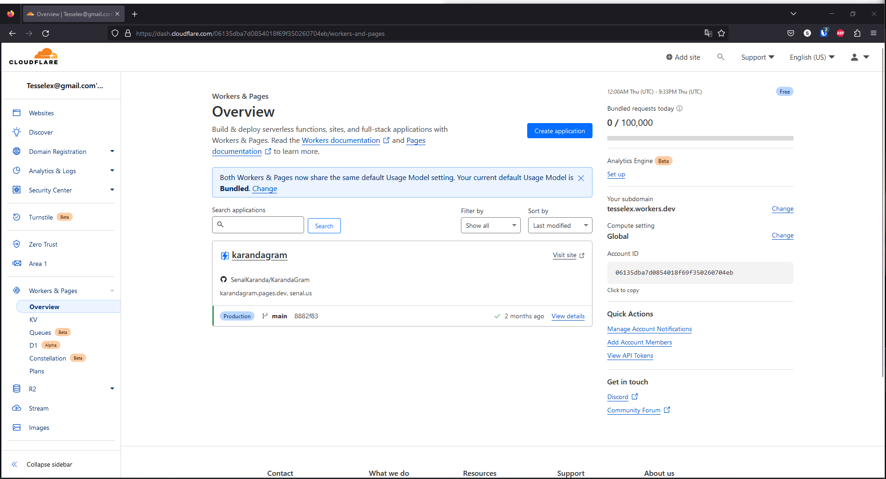
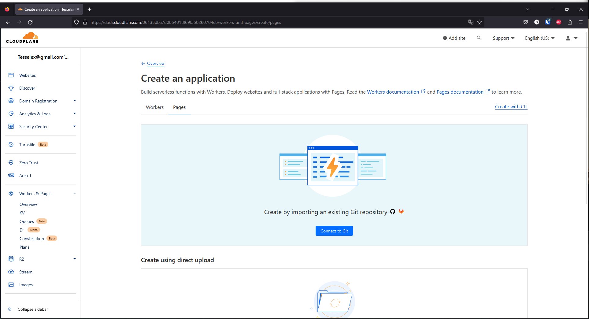
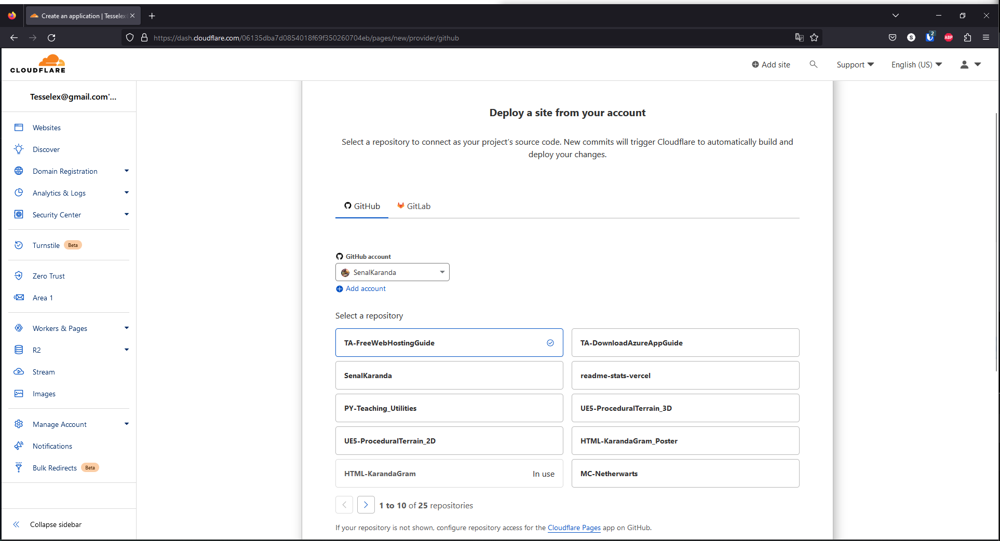
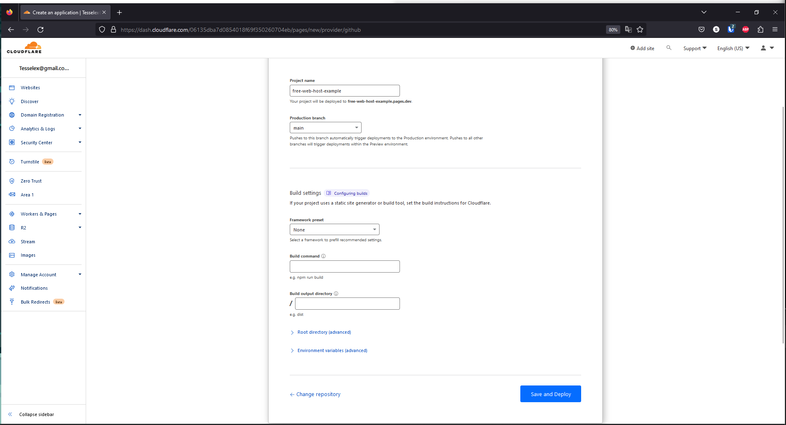
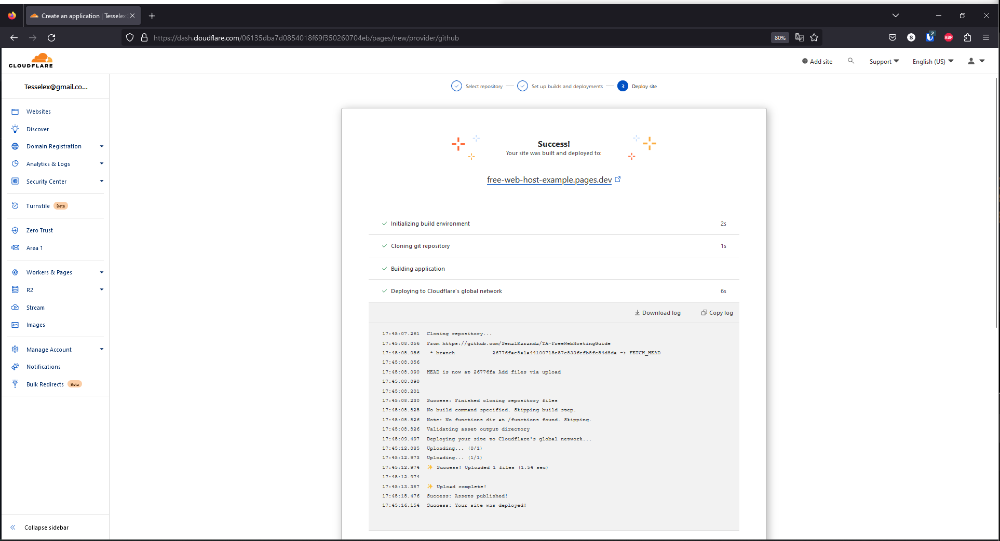
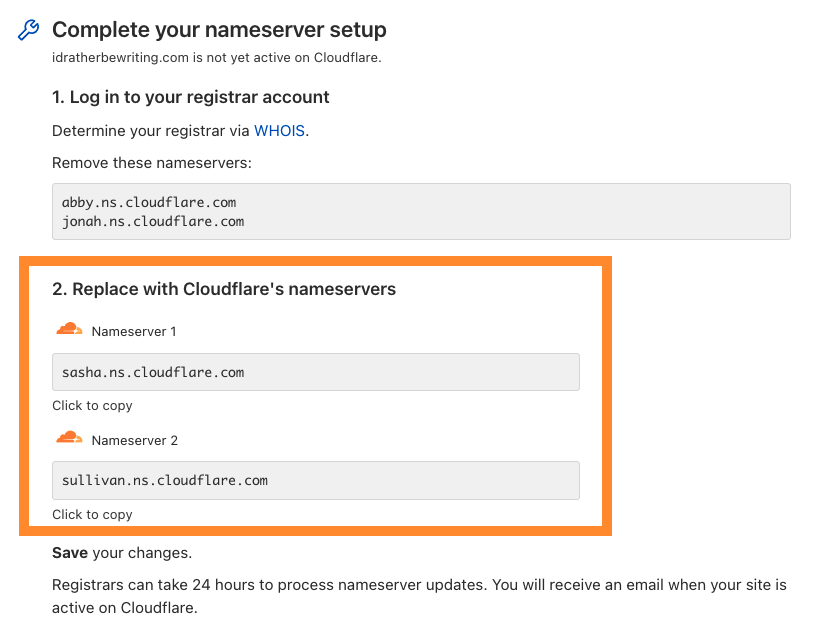

# Free Web Hosting with Cloudflare Pages

## Notes:
<div>
  <ul>
    <li>Cloudflare pages allows hosting websites using a feature called Pages, which perfectly suits our needs for the class.</li>
  </ul>
</div>

## Prerequisite Steps (REQUIRED)
<div>
  <ul>
    <li>Make a Cloudflare account <a href="https://dash.cloudflare.com/sign-up?pt=f">here</a></li>
    <li>Make sure you have a Github repository with your website ready.</li>
  </ul>
</div>

## Step 1: 
### In Cloudflare, navigate to ```Workers & Pages``` on the left-hand bar



## Step 2: 
### Press ```Create Application```
#### Note: The button for creating an app may not show up for you, if you have no previous apps. In that case, proceed with the next steps.


## Step 3: 
### Press ```Connect to Git```



## Step 4: 
### Login to your GitHub account and make sure it's selected
### Select the repository containing your Blog
### Go to the next section



## Step 5: 
### Set your project name, and press ```Save and Deploy```



## Step 6: 
### Your website has been deployed via cloudflare!
#### I will be creating another set of instructions on how to connect your own domain to the deployment, if you bought one for Project 1.



----

# Custom Domain with Cloudflare Pages (Optional)

## Part I: Add Domain to Cloudflare

### Step 1:
#### In Cloudflare, navigate to ```Workers & Pages``` on the left-hand bar

### Step 2:
#### Select your Pages project, then select ```Custom domains```

### Step 3:
#### Select ```Set up a domain```

### Step 4:
#### Provide the domain that you would like to use, and select ```Continue```
#### It should look like this:


### Step 5:
#### Press ```Complete DNS setup```

##### When you start using Cloudflare’s nameservers for authoritative DNS and your zone is in a full setup, Cloudflare will become your primary DNS provider. This means that your DNS records in Cloudflare need to be accurate for your domain to work properly.

##### When you add a new site to Cloudflare, Cloudflare automatically scans for common records and adds them to the DNS zone. The records show up under the respective zone DNS > Records page.

### Step 6:
#### You should be at the ```Complete your nameserver setup``` section

##### Keep this window open while you perform the next part



## Part II: Setup Nameservers (GoDaddy)

### Step 1:
#### Sign in to your GoDaddy Domain Portoflio

### Step 2:
#### Select the checkbox next to the domain you're going to use

### Step 3:
#### Select ```Nameservers```

##### Depending on your screen size, you may need to select the ```More``` menu and scroll down to see ```Nameservers```

### Step 4:
#### Select ```I'll use my own nameservers``` and enter the nameservers provided by Cloudflare.

### Step 6:
#### Select ```Save```, then ```Continue``` to complete your updates

##### If your domain has Domain Protection, you'll need to verify your identity. If you've had two-step verification (2SV) turned on for at least 24 hours, enter the code we sent via SMS, or enter the code from your authenticator app. Otherwise, enter the one-time password we sent to your registrant email address.

### Step 7:
##### You'll see a Success confirmation letting you know the nameservers have been updated. Most DNS updates take effect within an hour, but could take up to 48 hours to update globally.

## Part III: Finishing Up

### Step 1: Verify Changes
#### On the Cloudflare page you kept open, verify the changes

##### When your domain is Active, you will: Receive an email from Cloudflare, your domain will have a status of Active on the Websites page of your account.

----
